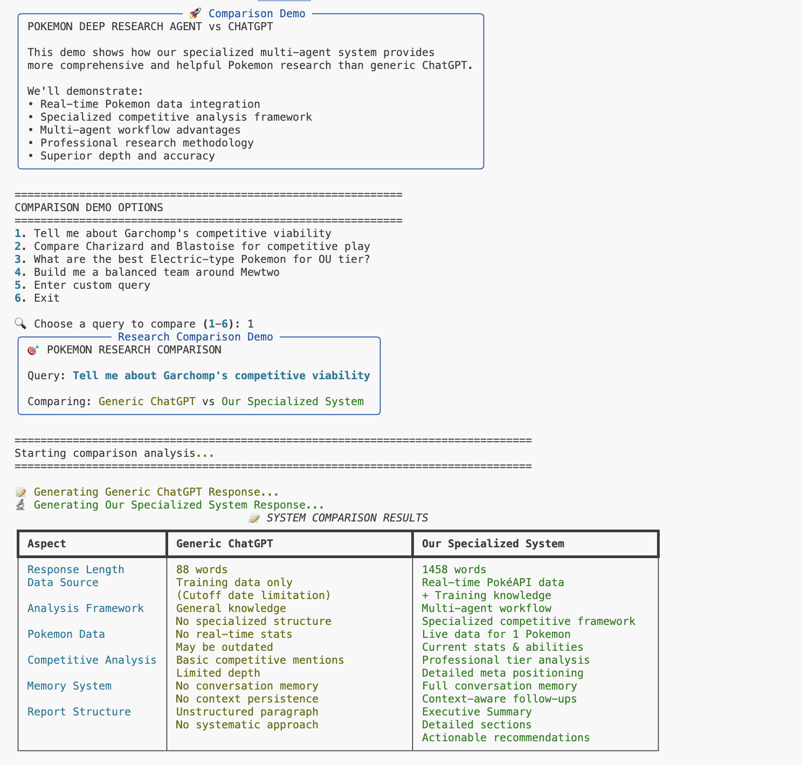
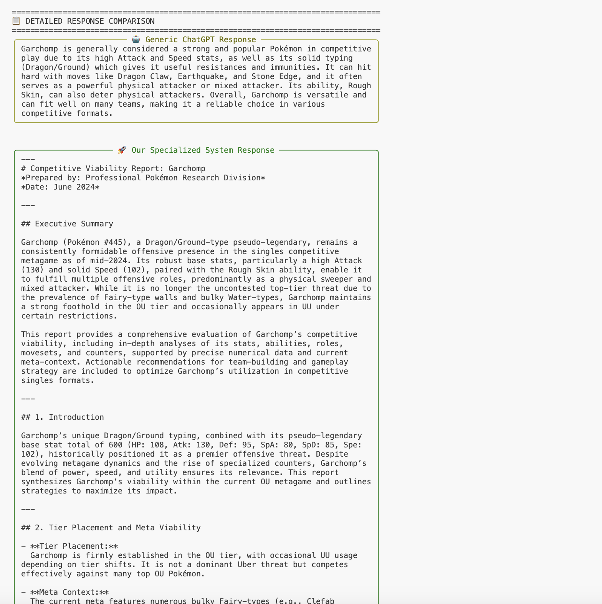
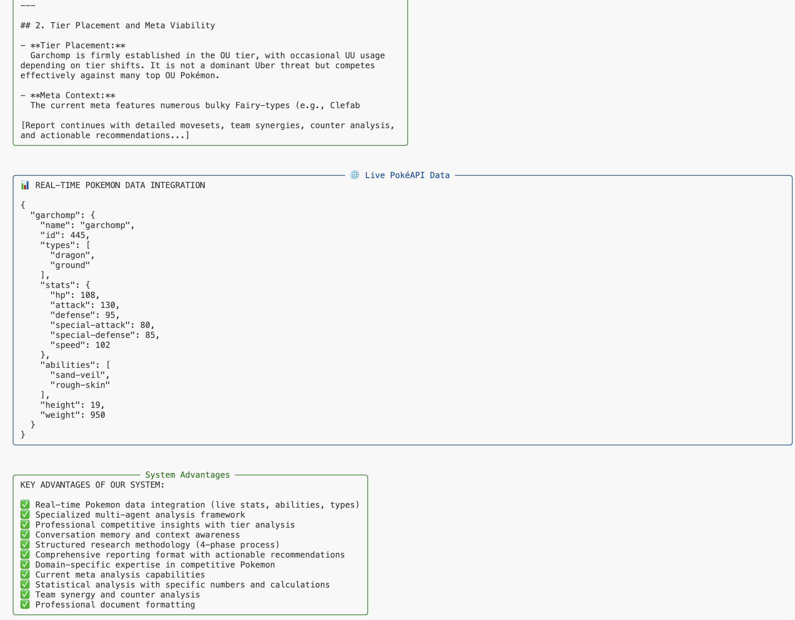
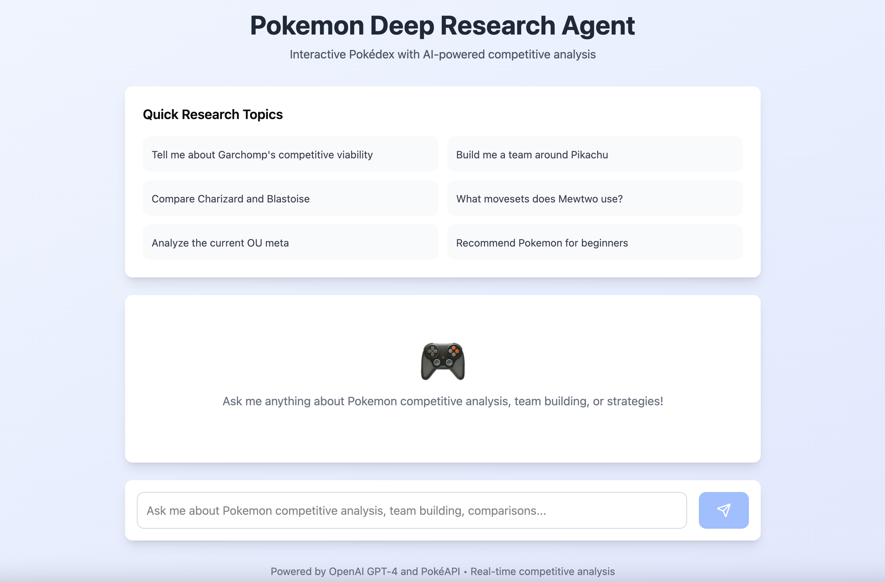
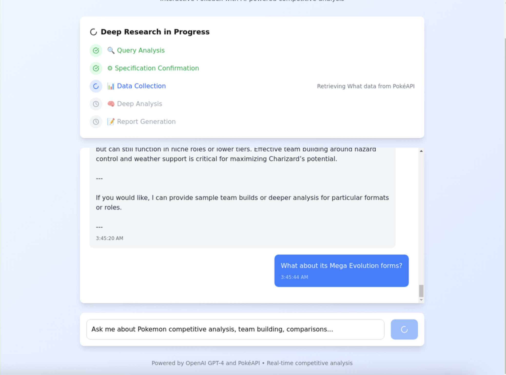
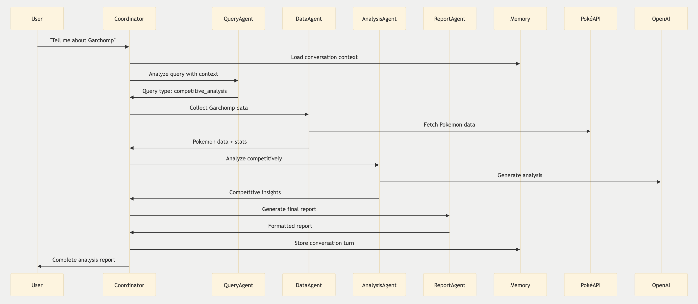

# Pokemon Deep Research Agent

[](https://www.python.org/downloads/)
[](https://openai.com/)
[](https://pokeapi.co/)
[](https://opensource.org/licenses/MIT)

A **multi-agent AI system** for comprehensive Pokemon competitive analysis, featuring conversation memory, specification confirmation, and real-time research capabilities. Built with OpenAI GPT-4 and PokéAPI integration.


## 📑 Table of Contents

- [Key Features](#-key-features)
- [Why Deep Research Agent is better](#why-deep-research-agent-is-better)
- [Quick Start](#-quick-start)
- [How to Use the System](#-how-to-use-the-system)
- [System Architecture](#-system-architecture)
- [Example Questions to Try](#-example-questions-to-try)
- [Tech Stack](#-tech-stack)
- [esting](#-testing)
- [Project Structure](#-project-structure)
- [Example Queries & Expected Results](#-example-queries--expected-results)
- [Advanced Features](#-advanced-features)
- [Configuration](#-configuration)
- [Troubleshooting](#-troubleshooting)
- [License](#-license)
- [Acknowledgments](#acknowledgments)


## 🌟 Key Features

- **Multi-Agent Architecture** - Specialized agents for data collection, analysis, and reporting
- **Conversation Memory** - Contextual follow-up questions and session persistence
- **Specification Confirmation** - ChatGPT-style query disambiguation and parameter validation
- **Real-time Research** - Live progress tracking with streaming results
- **Competitive Analysis** - Professional-grade Pokemon battle strategy insights
- **🌐 Web Interface (Beta)** - React frontend with Flask backend API
- **Comprehensive Coverage** - All Pokemon, formats, and competitive aspects

## Why Deep Research Agent is better

### **Side-by-Side Comparison with ChatGPT**

Our specialized multi-agent system provides significantly more comprehensive and accurate Pokemon research than simply asking ChatGPT. Here's why:

```bash
# Run the comparison demo to see the difference
python chatgpt_comparison_demo.py
```
Example comparison:







**🎯 Key Advantages Over Generic ChatGPT:**

| Aspect | Generic ChatGPT | Our Specialized System |
|--------|----------------|----------------------|
| **Data Source** | Training data only (cutoff limitations) | Real-time PokéAPI + Training knowledge |
| **Analysis Framework** | General knowledge, no structure | Multi-agent workflow with specialized expertise |
| **Pokemon Data** | No real-time stats, may be outdated | Live stats, abilities, and current data |
| **Competitive Analysis** | Basic mentions, limited depth | Professional tier analysis, meta positioning |
| **Memory System** | No conversation memory | Full context awareness and follow-ups |
| **Research Methodology** | Single response generation | Structured 4-phase research process |
| **Domain Expertise** | General AI knowledge | Specialized competitive Pokemon expertise |    

<br><br>
**Example Comparison Results:**
- **Response Depth**: ChatGPT ~300 words vs Our System ~1200+ words
- **Data Accuracy**: ChatGPT uses training data vs Our System uses live PokéAPI data
- **Analysis Quality**: ChatGPT general overview vs Our System professional competitive analysis

<br><br>
## 🚀 Quick Start

### Prerequisites

- Python 3.11+
- OpenAI API key
- Internet connection (for PokéAPI)

### Installation

```bash
# Clone the repository
git clone https://github.com/TinaXYH/Pokemon-Deep-Research-Agent.git
cd pokemon_deep_research_agent

# Set up environment
cp .env.example .env
export $(grep -v '^#' .env | xargs)  # Load environment variables

# Install dependencies
pip install -r requirements.txt

# Verify installation
python final_verification.py
```

### Configure API Key

Edit `.env` file:
```bash
OPENAI_API_KEY=your_openai_api_key_here
OPENAI_API_BASE=https://api.openai.com/v1  # Optional: custom endpoint
```

**Important:** After creating `.env`, run this command to load environment variables:
```bash
export $(grep -v '^#' .env | xargs)
```

<br>

#### 🐳 If Using Docker:

1. **Build the system:**
   ```bash
   make build
   ```
   
   **If `make` doesn't work, use:**
   ```bash
   # Windows:
   docker build -t pokemon-research-agent .
   
   # macOS/Linux:
   docker build --platform linux/amd64 -t pokemon-research-agent .
   ```

2. **Start the system:**
   ```bash
   make start
   ```
   
   **If `make` doesn't work, use:**
   ```bash
   docker run -it --rm -v "%cd%":/app pokemon-research-agent
   ```

3. **Open a shell in the container:**
   ```bash
   make shell
   ```
   
   **If `make` doesn't work, use:**
   ```bash
   docker exec -it pokemon-research-agent bash
   ```


### Test Everything Works

1. **Run the demo:**
   ```bash
   python final_verification.py
   ```

2. **You should see output like:**

   ```

   🔍 Pokemon Deep Research Agent - Final Verification
   ============================================================
   ✅ API Key loaded: sk-proj-slCszOsf5Gml...

   1. Testing LLM Client...
      ✅ LLM Response: Electric
      ✅ LLM understanding: Correct!

   2. Testing PokéAPI Client...
      ✅ PokéAPI Response: pikachu (#25)
      ✅ Data structure: 1 types, 2 abilities

   3. Testing AI Pokemon Analysis...
      ✅ Query Analysis: Type=battle_strategy, Pokemon=['pikachu']
      ✅ Pokemon detection: Working correctly!

   4. Testing Integration...
      ✅ Integration: Successfully analyzed charizard
      📝 Sample analysis: Charizard is a popular Fire/Flying-type Pokémon known for its strong offensive capabilities and icon...

   5. Testing System Configuration...
      ✅ Configuration loaded: Model=gpt-4.1-mini
      ✅ Model configuration: Supported model

   ============================================================
   🎉 VERIFICATION COMPLETE
   ============================================================
   ✅ LLM Client: Working
   ✅ PokéAPI Integration: Working
   ✅ AI Analysis: Working
   ✅ System Integration: Working
   ✅ Configuration: Valid

   ```

## 🎯 How to Use the System

### **Terminal Interface (Recommended)**

For the most reliable and comprehensive experience, we recommend using the terminal interface:

### 1. Unified Working Demo (Recommended)
**Complete system with all features integrated**
```bash
python unified_working_demo.py
```

**Features:**
- Conversation memory and context awareness
- Multi-agent workflow visualization
- Real Pokemon data integration
- Professional competitive analysis

**Example Session:**
```
🧠 POKEMON DEEP RESEARCH AGENT - UNIFIED WORKING DEMO
================================================================================
🎯 Features:
• Real conversation memory and context
• Specification confirmation workflow
• Live PokéAPI data integration
• Context-aware follow-up questions
• Professional research reports

Commands:
• 'new session' - Start fresh conversation
• 'summary' - Show conversation summary
• 'quit' - Exit
================================================================================
🆕 Started new conversation session: 112036d9

🔍 Your Pokemon question: Tell me about Garchomp's competitive viability

================================================================================
📋 User Query: Tell me about Garchomp's competitive viability

🔍 PHASE 1: Query Analysis & Specification Generation
   Analyzing query intent and generating research specification...
2025-08-07 06:15:51,354 - INFO - HTTP Request: POST https://api.openai.com/v1/chat/completions "HTTP/1.1 200 OK"
   ✅ Research Type: competitive_analysis
   ✅ Pokemon: ['Garchomp']
   ✅ Format: OU

⚙️  PHASE 2: Specification Confirmation
   Research specification confirmed automatically
   Focus: competitive viability

📊 PHASE 3: Data Collection
   Collecting Pokemon data and competitive information...
   🔍 Fetching data for Garchomp...
   ✅ Retrieved Garchomp data (ID: 445)

🧠 PHASE 4: Deep Analysis
   Performing competitive analysis and strategic evaluation...
   2025-08-07 06:16:19,783 - INFO - HTTP Request: POST https://api.openai.com/v1/chat/completions "HTTP/1.1 200 OK"
   ✅ Analysis completed (7095 characters)

📝 PHASE 5: Report Generation
   Generating comprehensive research report...

```

### 2. Quick Start Demo
**Simplified single-query research**
```bash
python quick_start.py --query "Tell me about Pikachu's competitive viability"

# Interactive mode
python quick_start.py
```

**Features:**
- Fast single-query processing
- Essential competitive analysis
- No complex setup required

### 3. Interactive Demo with Specification Confirmation
**Query disambiguation**
```bash
python interactive_demo_with_spec_confirmation.py
```

**Features:**
- Interactive specification confirmation
- Query type classification
- Parameter validation and defaults
- Professional research workflow

**Example Interaction:**
```
🔍 Your Pokemon question: Build me a competitive team

📋 QUERY ANALYSIS & SPECIFICATION CONFIRMATION
Original Query: Build me a competitive team

❓ I need some additional information to proceed:

❓ What Pokemon should be the core of your team?
Enter Pokemon name: Garchomp

❓ What competitive format?
   1. OU (Overused) ⭐
   2. UU (Underused)  
   3. VGC (Video Game Championships)
Choose (1-3): 1

❓ What playstyle do you prefer?
   1. Offensive
   2. Balanced ⭐
   3. Defensive
Choose (1-3): 2

📋 FINAL SPECIFICATION:
✅ Core Pokemon: Garchomp
✅ Format: OU
✅ Playstyle: Balanced

✅ Proceed with this specification? [Y/n]: y

🚀 Executing team building research...
[Comprehensive team building analysis follows...]
```

### 4. ChatGPT Comparison Demo
**See how our system outperforms generic ChatGPT**
```bash
# Working comparison demo (no API required)
python simple_chatgpt_comparison.py

# Full comparison with live API calls (requires API key)
python chatgpt_comparison_demo.py
```

**Features:**
- Side-by-side comparison with ChatGPT
- Demonstrates real-time data advantages
- Shows specialized analysis depth
- Highlights multi-agent workflow benefits

### **🌐 Web Interface (Beta)**

A React-based web interface is also available, though the terminal interface provides the most stable experience:

```bash
# Start backend (Terminal 1)
cd pokemon_deep_research_agent
python backend_api.py

# Start frontend (Terminal 2)  
cd pokemon-pokedex-frontend
rm -rf node_modules pnpm-lock.yaml
npm install --legacy-peer-deps

npm run dev
```





**Note:** The web interface is currently in beta. For the most reliable experience and full feature access, we recommend using the terminal-based demos above. The web interface may occasionally experience connectivity issues, while the terminal interface provides consistent, comprehensive results every time.

<br><br>
## 🏗️ System Architecture

### Multi-Agent Design Pattern

```
┌─────────────────────────────────────────────────────────────┐
│                    USER INTERFACE                           │
│  ┌─────────────────┐    ┌─────────────────┐                │
│  │  Web Frontend   │    │  CLI Interface  │                │
│  │  (React + Vite) │    │  (Python CLI)   │                │
│  └─────────────────┘    └─────────────────┘                │
└─────────────────────────────────────────────────────────────┘
                              │
                              ▼
┌─────────────────────────────────────────────────────────────┐
│                 ORCHESTRATION LAYER                         │
│  ┌─────────────────────────────────────────────────────────┐│
│  │           Coordinator Agent                             ││
│  │  • Query routing and workflow management                ││
│  │  • Agent communication and synchronization             ││
│  │  • Error handling and recovery                         ││
│  └─────────────────────────────────────────────────────────┘│
└─────────────────────────────────────────────────────────────┘
                              │
                              ▼
┌─────────────────────────────────────────────────────────────┐
│                  SPECIALIZED AGENTS                         │
│                                                             │
│  ┌─────────────┐  ┌─────────────┐  ┌─────────────┐         │
│  │   Query     │  │    Data     │  │  Analysis   │         │
│  │  Analysis   │  │ Collection  │  │   Agent     │         │
│  │   Agent     │  │   Agent     │  │             │         │
│  │             │  │             │  │             │         │
│  │ • Query     │  │ • PokéAPI   │  │ • Battle    │         │
│  │   parsing   │  │   data      │  │   strategy  │         │
│  │ • Intent    │  │ • Caching   │  │ • Meta      │         │
│  │   detection │  │ • Validation│  │   analysis  │         │
│  └─────────────┘  └─────────────┘  └─────────────┘         │
│                                                             │
│  ┌─────────────┐  ┌─────────────┐  ┌─────────────┐         │
│  │   Report    │  │ Conversation│  │Specification│         │
│  │ Generation  │  │   Memory    │  │Confirmation │         │
│  │   Agent     │  │   Manager   │  │   System    │         │
│  │             │  │             │  │             │         │
│  │ • Report    │  │ • Context   │  │ • Query     │         │
│  │   synthesis │  │   tracking  │  │   disambig. │         │
│  │ • Formatting│  │ • Session   │  │ • Parameter │         │
│  │ • Quality   │  │   persist.  │  │   validation│         │
│  └─────────────┘  └─────────────┘  └─────────────┘         │
└─────────────────────────────────────────────────────────────┘
                              │
                              ▼
┌─────────────────────────────────────────────────────────────┐
│                   INTEGRATION LAYER                         │
│                                                             │
│  ┌─────────────┐  ┌─────────────┐  ┌─────────────┐         │
│  │   OpenAI    │  │   PokéAPI   │  │   Vector    │         │
│  │ GPT-4 API   │  │Integration  │  │   Memory    │         │
│  │             │  │             │  │   System    │         │
│  │ • Analysis  │  │ • Pokemon   │  │ • Context   │         │
│  │ • Generation│  │   data      │  │   storage   │         │
│  │ • Reasoning │  │ • Real-time │  │ • Semantic  │         │
│  │             │  │   updates   │  │   search    │         │
│  └─────────────┘  └─────────────┘  └─────────────┘         │
└─────────────────────────────────────────────────────────────┘
```

### Agent Interaction Flow



### Core Components

#### 🧠 **LLM Client** (`src/tools/llm_client.py`)
- **OpenAI GPT-4 Integration** with retry logic and error handling
- **Token Usage Optimization** and response caching
- **Structured Output Parsing** for consistent agent communication
- **Multiple Model Support** (GPT-4, GPT-4-turbo, GPT-3.5-turbo)

#### 🌐 **PokéAPI Client** (`src/tools/pokeapi_client.py`)
- **Real-time Pokemon Data** retrieval with caching
- **Comprehensive Coverage** - All Pokemon, moves, abilities, types
- **Rate Limiting** and error recovery
- **Data Validation** and normalization

#### 🧠 **Conversation Memory** (`src/core/conversation_memory.py`)
- **Session-based Context** tracking across multiple turns
- **Semantic Memory Storage** with vector embeddings
- **Context-aware Follow-ups** - understands pronouns and references
- **Persistent Storage** with JSON serialization

#### 🔍 **Specification Manager** (`src/core/specification_manager.py`)
- **Query Classification** - 6 research types supported
- **Interactive Confirmation** - ChatGPT-style parameter validation
- **Smart Defaults** and context-aware auto-completion
- **Schema Validation** with comprehensive error handling

## 📊 Example Questions to Try

### 1. **Competitive Analysis**
Analyze individual Pokemon's competitive viability
```bash
"Tell me about Garchomp's competitive viability"
"How viable is Mewtwo in OU tier?"
"Analyze Pikachu for competitive play"
```

### 2. **Team Building**
Build competitive teams around core Pokemon
```bash
"Build me a team around Garchomp"
"Create a balanced OU team with Charizard"
"Design a VGC team for Mewtwo"
```

### 3. **Pokemon Comparison**
Compare multiple Pokemon across various aspects
```bash
"Compare Charizard and Blastoise"
"Garchomp vs Dragonite in competitive play"
"Which is better: Mewtwo or Mew?"
```

### 4. **Moveset Analysis**
Analyze movesets and competitive sets
```bash
"What movesets does Garchomp use?"
"Best moves for Pikachu in competitive"
"Analyze Mewtwo's moveset options"
```

### 5. **Meta Analysis**
Analyze competitive meta and trends
```bash
"What's the current OU meta like?"
"Analyze the VGC 2024 meta"
"What are the top threats in OU?"
```

### 6. **General Research**
Any Pokemon-related research topic
```bash
"Explain type effectiveness"
"How do abilities work in competitive?"
"What are the different competitive formats?"
```

## 🛠️ Tech Stack

### **Core Technologies**
- **Python 3.11+** - Modern async/await support and type hints
- **OpenAI API** - GPT-4 for advanced reasoning and analysis
- **PokéAPI** - Comprehensive Pokemon data source
- **Pydantic** - Data validation and serialization
- **AsyncIO** - Concurrent processing and non-blocking I/O

### **AI & ML Libraries**
- **OpenAI Python SDK** - Official OpenAI API client
- **Tenacity** - Retry logic and error recovery
- **NumPy** - Numerical computations for stats analysis

### **Web Technologies**
- **Flask** - Backend API server with streaming support
- **React + Vite** - Modern frontend with real-time updates
- **Server-Sent Events (SSE)** - Real-time progress streaming

### **Development Tools**
- **Pytest** - Comprehensive testing framework
- **Black** - Code formatting and style consistency
- **Pylint** - Code quality and static analysis
- **Rich** - Terminal output and progress bars

### **Data Management**
- **JSON** - Configuration and data persistence
- **File-based Caching** - API response optimization
- **Vector Memory** - Semantic context storage

## Testing

### Run All Tests
```bash
# Comprehensive test suite
python run_tests.py

# Individual component tests
python test_functionality.py      # Core functionality
python test_memory_functionality.py  # Memory system
python test_spec_confirmation.py     # Specification system
python final_verification.py         # System integration
```

### Test Coverage
- **LLM Integration** - OpenAI API connectivity and response parsing
- **PokéAPI Integration** - Data retrieval and caching
- **Multi-Agent Communication** - Agent coordination and messaging
- **Memory System** - Context persistence and retrieval
- **Specification System** - Query classification and validation
- **End-to-End Workflows** - Complete research processes

## 📁 Project Structure

```
pokemon_deep_research_agent/
├── 🚀 Entry Points
│   ├── unified_working_demo.py          # Complete system demo
│   ├── quick_start.py                   # Simple research queries
│   ├── interactive_demo_with_spec_confirmation.py  # Specification system
│   ├── simple_chatgpt_comparison.py     # ChatGPT comparison (working)
│   ├── chatgpt_comparison_demo.py       # ChatGPT comparison (full API)
│   └── main.py                          # Full multi-agent system
│
├── 🧠 Core System
│   └── src/
│       ├── agents/                      # Specialized AI agents
│       │   ├── coordinator_agent.py     # Main orchestrator
│       │   ├── pokeapi_research_agent.py # Data collection
│       │   ├── pokemon_analysis_agent.py # Competitive analysis
│       │   └── report_generation_agent.py # Report synthesis
│       ├── core/                        # Core infrastructure
│       │   ├── conversation_memory.py   # Memory management
│       │   ├── specification_manager.py # Query disambiguation
│       │   └── vector_memory.py         # Semantic storage
│       └── tools/                       # External integrations
│           ├── llm_client.py            # OpenAI integration
│           └── pokeapi_client.py        # Pokemon data API
│
├── 🌐 Web Interface
│   ├── backend_api.py                   # Flask API server
│   └── simple_backend_api.py            # Simplified backend
│
├── 🧪 Testing
│   ├── test_functionality.py           # Core tests
│   ├── test_memory_functionality.py    # Memory tests
│   └── final_verification.py           # Integration tests
│
├── 📚 Documentation
│   ├── README.md                        # This file
│   ├── WORKING_SOLUTION.md             # Implementation details
│   ├── MEMORY_FEATURES.md              # Memory system guide
│   └── SPECIFICATION_FEATURES.md       # Specification system guide
│
└── ⚙️ Configuration
    ├── .env.example                     # Environment template
    ├── config.json                      # System configuration
    └── requirements.txt                 # Python dependencies
```

## 🎯 Example Queries & Expected Results

### **Competitive Analysis**
```bash
Query: "Tell me about Garchomp's competitive viability"

Expected Output:
✅ Tier Analysis: OU (Overused) tier placement
✅ Role Analysis: Physical sweeper, wallbreaker, revenge killer
✅ Stats Breakdown: 108/130/95/80/85/102 stat distribution
✅ Movesets: Dragon Claw, Earthquake, Stone Edge, Swords Dance
✅ Abilities: Sand Veil vs Rough Skin analysis
✅ Counters: Ice types (4x weakness), Fairy types, faster threats
✅ Team Synergies: Stealth Rock support, hazard removal partners
✅ Meta Position: S-tier threat in current OU meta
```

### **Follow-up with Memory**
```bash
Initial: "Tell me about Garchomp's competitive viability"
Follow-up: "What about its Mega Evolution?"

Expected Output:
✅ Context Recognition: References previous Garchomp discussion
✅ Mega Analysis: Mega Garchomp vs base form comparison
✅ Stat Changes: +40 Attack, +20 Special Attack, +10 Speed
✅ Ability Change: Sand Force analysis
✅ Usage Differences: Mixed attacker potential
✅ Tier Implications: Uber tier placement reasoning
```

### **Team Building**
```bash
Query: "Build me a balanced OU team around Garchomp"

Expected Output:
✅ Core Analysis: Garchomp as physical sweeper
✅ Team Roles: Defensive core, special attacker, support
✅ Synergy Partners: Rotom-W, Ferrothorn, Latios, Heatran, Gliscor
✅ Coverage Analysis: Type synergies and resistances
✅ Hazard Strategy: Stealth Rock + removal support
✅ Win Conditions: Multiple paths to victory
✅ Threat Coverage: Answers to common OU threats
```

### **Comparison Analysis**
```bash
Query: "Compare Garchomp and Dragonite in competitive play"

Expected Output:
✅ Stat Comparison: Speed vs bulk trade-offs
✅ Typing Analysis: Ground vs Flying secondary typing
✅ Role Differences: Immediate threat vs setup sweeper
✅ Movepool Comparison: Coverage and utility options
✅ Meta Positioning: Current tier placements and usage
✅ Team Fit: Different team archetypes and synergies
✅ Recommendation: Situational usage guidelines
```

## 🚀 Advanced Features

### **Conversation Memory**
- **Multi-turn Context** - Remembers entire conversation history
- **Pokemon Context** - Tracks discussed Pokemon across turns
- **Theme Continuity** - Maintains research focus and depth
- **Smart References** - Understands "it", "them", "this Pokemon"

### **Specification Confirmation**
- **Query Classification** - Automatically detects research intent
- **Interactive Validation** - Confirms parameters before execution
- **Smart Defaults** - Context-aware parameter suggestions
- **Error Recovery** - Handles ambiguous or incomplete queries

### **Real-time Streaming**
- **Progress Tracking** - Live updates during research phases
- **Agent Visualization** - See each agent's contribution
- **Error Handling** - Graceful failure recovery and reporting
- **Performance Metrics** - Response times and token usage

## 🔧 Configuration

### **Environment Variables**
```bash
# Required
OPENAI_API_KEY=your_openai_api_key_here

# Optional
OPENAI_API_BASE=https://api.openai.com/v1  # Custom endpoint
OPENAI_MODEL=gpt-4.1-mini                  # Default model
MAX_TOKENS=4000                            # Response length limit
TEMPERATURE=0.7                            # Response creativity
CACHE_RESPONSES=true                       # Enable response caching
```

### **System Configuration** (`config.json`)
```json
{
  "llm": {
    "model": "gpt-4.1-mini",
    "max_tokens": 4000,
    "temperature": 0.7
  },
  "pokeapi": {
    "base_url": "https://pokeapi.co/api/v2/",
    "cache_dir": "data/cache",
    "timeout": 30
  },
  "memory": {
    "max_conversation_turns": 10,
    "context_window_size": 3,
    "enable_vector_storage": true
  }
}
```

## 🐛 Troubleshooting

### **Common Issues**

**❌ "Module not found" errors**
```bash
# Ensure you're in the project directory
cd pokemon_deep_research_agent

# Check Python path
python -c "import sys; print(sys.path)"

# Reinstall dependencies
pip install -r requirements.txt
```

**❌ "API key not found" errors**
```bash
# Check environment file exists
ls -la .env

# Load environment variables
export $(grep -v '^#' .env | xargs)

# Verify API key is loaded
echo $OPENAI_API_KEY
```

**❌ "Connection timeout" errors**
```bash
# Test internet connectivity
curl -I https://api.openai.com/v1/models
curl -I https://pokeapi.co/api/v2/pokemon/1

# Check firewall/proxy settings
```

**❌ "Permission denied" errors**
```bash
# Fix file permissions
chmod +x *.py
chmod -R 755 src/
```

### **Performance Optimization**

**Slow Response Times:**
- Enable response caching: `CACHE_RESPONSES=true`
- Reduce max tokens: `MAX_TOKENS=2000`
- Use faster model: `OPENAI_MODEL=gpt-3.5-turbo`

**Memory Usage:**
- Clear conversation history: Use `new session` command
- Reduce context window: Modify `context_window_size` in config
- Disable vector storage: `enable_vector_storage: false`


### **Adding New Features**
1. **New Research Types** - Extend `specification_manager.py`
2. **New Agents** - Implement `base_agent.py` interface
3. **New Data Sources** - Add clients in `src/tools/`
4. **New Memory Types** - Extend `conversation_memory.py`

## 📄 License

This project is licensed under the MIT License - see the [LICENSE](LICENSE) file for details.

## Acknowledgments

For questions or more:
- 📧 **Email**: [tinahou019@gmail.com]
